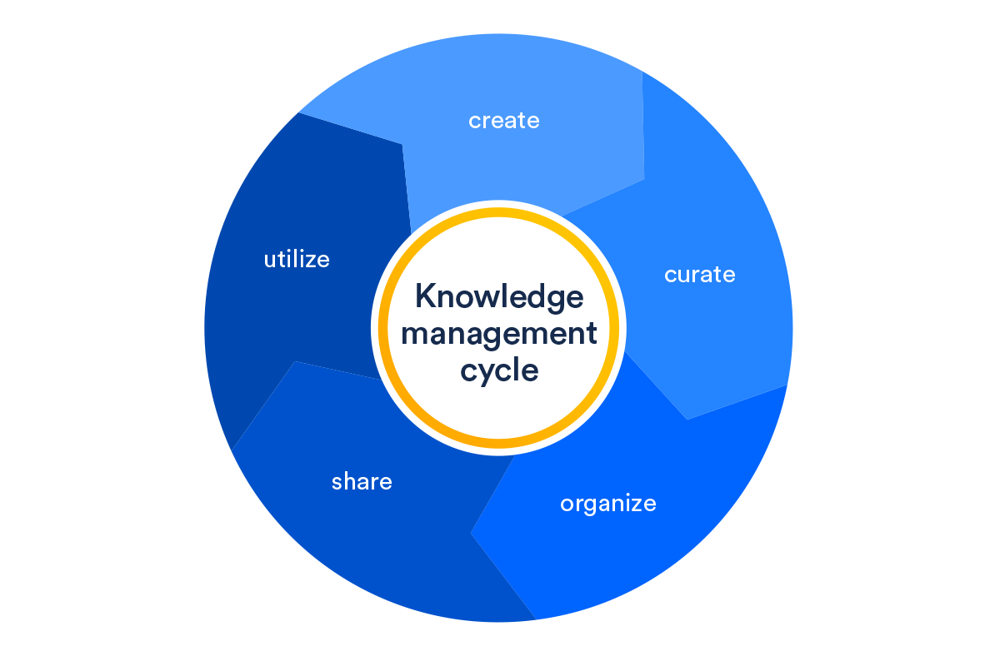

Gestão do Conhecimento para empresas que querem crescer com sabedoria
=================================

Antes de ler este artigo, responda com sinceridade as perguntas abaixo. 

1. Sua empresa repete os mesmos erros?
2. Existem trabalhos duplicados?
3. As boas ideias não são compartilhadas?
4. Existe dependência de pessoas-chave? 
5. O processo de lançamento de novos produtos/serviços é lento?

Se você respondeu um sonoro **“SIM”** para pelo menos 1 pergunta acima, sim, você precisa implementar a gestão do conhecimento na sua empresa. Fique tranquilo, há luz no fim do túnel.

Gestão do que?
------------------
Dentre as diversas definições, gosto particularmente da que diz que a Gestão do Conhecimento pode ser compreendida como um **ciclo constante** de lidar efetivamente com o conhecimento dentro de uma organização, da criação à aplicação, **para que as informações corretas possam ser encontradas no momento certo**. 

``Simplificando, esse ciclo consiste em criar, ajustar, organizar, compartilhar, utilizar e repetir, de novo e de novo.`` 

:subscript:`Esse processo é bastante semelhante ao DDLC (Document Development Life Cycle).`

Não podemos negar que, na última década, os motores de busca tornaram a Gestão do Conhecimento mais fácil. Afinal, eles tiram proveito de uma vasta base de conhecimento internacionalmente conectada, também conhecida como internet. 

Você precisa de algo e lá está o conhecimento. Fácil. Rápido. A um clique. (Aliás, com o tal do Big Data e as análises preditivas, os sistemas já sabem o que você vai precisar antes mesmo de você pensar. Inovador e assustador ao mesmo tempo, mas papo pra um outro artigo.)

Mas, ainda que o conhecimento esteja a um clique quando falamos de informações globais, para uma empresa, a Gestão do Conhecimento pode ficar um tanto complicada.

A boa notícia é que existem excelentes práticas no mercado e ferramentas bem bacanas para desfazer essa complicação. A seguir, veremos dicas para tornar as práticas de gerenciamento* de conhecimento eficazes em toda uma empresa.

:subscript:`“Gestão” e “Gerenciamento” aqui são tratados como partes de um mesmo todo. O termo “Gestão” está voltado mais ao planejamento. Enquanto “Gerenciamento” envolve mais a parte prática.`

Breve histórico
------------------
Antes das dicas, faz sentido ver de onde surgiu essa tal de Gestão do Conhecimento e alguns conceitos amplamente mencionados. 

Há pelo menos três supostas origens do processo de GC (Gestão do Conhecimento) a partir da década de 80: 1. Nos Estados Unidos, quando começou-se a avaliar a transferência de conhecimento e o saber compartilhado na condução dos negócios e 2. Suécia e 3. Japão, com a preocupação com a renovação do conhecimento e a sua influência na inovação e ações competitivas. Especula-se que desde a década de 1990, a Gestão do Conhecimento se tornou vanguarda dos processos de gestão. Pesquisadores, consultores e especialistas incentivavam as empresas a considerar a criação do conhecimento como vantagem competitiva, visando à construção de um ambiente de aprendizado para preencher as demandas de uma sociedade do conhecimento pós-industrial.

3 Pilares
------------------
Na sua raíz, a GC se apoia em três grandes conceitos. Vamos passar por eles agora?

Dado
~~~~~~~~~~~~~~
Dentro da sua empresa, um dado é basicamente um registro de atividades, estruturas e operações. São as informações que ainda estão cruas e precisam ser trabalhadas, mas nem por isso deixam de ser importantes! É como aquela pauta no fim da reunião ou uma planilha para reunir contatos.

Informação
~~~~~~~~~~~~~~

É o momento em que uma mensagem com dados faz a diferença, em que - simplificando - existe um emitente ou receptor. Basicamente, é o passo depois do dado e o insumo mais importante de conteúdo dentro de uma organização. São dados interpretados, relevantes e capazes de gerar conhecimento.

Conhecimento
~~~~~~~~~~~~~~
Esse é o momento de reunir as micro e macro informações para gerar um conteúdo relevante. Não é algo simples de se processar, mas os estudiosos Davenport e Prusak (1992) descrevem o conhecimento como “um ser vivo, que cresce e se modifica à medida que interage com o meio ambiente”, ou seja, é algo que está em constante mudança e, por isso, exige sistemas para controlá-lo.

Recentemente, ainda foi incorporado mais um conceito: o de sabedoria, que podemos definir como “saber o que fazer com o conhecimento”.

Trazendo para a prática esses conceitos, temos:

- Dado: “15º C”
- Informação: “15º C é a previsão de temperatura para amanhã em SP”
- Conhecimento: “Vai fazer frio”
- Sabedoria: “Devo me agasalhar”

A união de dado, informação e conhecimento, com sabedoria, possibilita a tomada de decisões assertivas. (Leve seu casaquinho.)

Outros conceitos: conhecimento tácito, explícito e implícito
------------------
Agora que você já viu um pouco do histórico da GC, posso destacar que a Gestão do Conhecimento é um processo de transformar conhecimento **tácito ou implícito** em conhecimento **explícito**. 

Mas vamos dar um passo atrás e entender os 3 diferentes tipos de conhecimento que existem.

O **conhecimento tácito** é o conhecimento que deriva da experiência pessoal, contexto ou prática. Esse tipo de conhecimento está preso no cérebro de cada um, dificultando a comunicação com os outros. 

**Conhecimento explícito** é conhecimento codificado, ou conhecimento que foi **documentado** e é facilmente acessível. Dada a sua natureza simples, o conhecimento explícito é muito mais fácil de armazenar e recuperar em um sistema de gerenciamento de conhecimento. O desafio (bem complexo) é garantir que ele seja **revisado e atualizado**.

O **conhecimento implícito** está incorporado no processo, nas rotinas ou na cultura organizacional. Pode existir em um formato formalizado, como um manual ou diretrizes escritas, mas o conhecimento em si não é “palpável”. 

``Compreender os 3 tipos diferentes de conhecimento é importante, pois nos faz entender melhor como o conhecimento dentro da empresa deve ser gerenciado. Quando feito da maneira certa, este gerenciamento pode ajudar a criar valor, fomentar a inovação e facilitar o alcance de metas. É por isso que cada vez mais a Gestão do Conhecimento vem sendo adotada por organizações de todo o mundo.``

Gestão do Conhecimento = Decisões mais assertivas
------------------
O gerenciamento efetivo do conhecimento aproveita o conhecimento das **pessoas** em toda a organização e, depois, compartilha facilmente esse conhecimento entre os membros da equipe. A empresa não perde esse pensamento crítico quando alguém sai de férias, adoece ou ganha na Mega-Sena. 

Podemos usar o gerenciamento de conhecimento para desenvolver uma **base de conhecimento** que inclui tudo, desde documentos que suportam perguntas frequentes até dicas de solução de problemas ou informações fundamentais sobre determinado assunto. 

O objetivo é compartilhar. **Mantenha atualizada** toda a documentação de suas soluções, manuais de uso, release notes, guias de instalação, entre outras informações. Deixe que os times também criem, compartilhem e discutam ideias, projetos, entre outros.

De um ponto de vista geral, a Gestão do Conhecimento permitirá que você:

* **Crie valor.** Disponibilize as informações certas para as pessoas certas no momento certo.
* **Promova a inovação.** Use conhecimento compartilhado para inspirar, colaborar e ter grandes ideias.
* **Alcance objetivos.** Permita que as equipes definam metas e realmente as atinjam.

Parece muito bom pra ser verdade, mas depois de criar um plano, você começará a ver retornos mais concretos de seu investimento.

``Para empresas de todos os tamanhos (mesmo), a Gestão do Conhecimento coloca o conteúdo na ponta dos dedos daqueles que desenvolvem e fornecem seus produtos e serviços. Este é um benefício por si só, mas uma boa gestão do conhecimento também aumenta a conectividade entre os times, reduz o setup time, aumenta a qualidade das entregas e aproveita o capital intelectual da organização. Consequentemente, a satisfação do cliente final tende a melhorar.
Aos poucos, você começa a resolver sutilmente aqueles problemas que comentei lá no início.``

Todo mundo quer compartilhar
------------------
Seja qual for o tipo de negócio, as pessoas em toda a organização têm um conhecimento valioso que vale a pena compartilhar. Todos. De verdade. E as pessoas anseiam por isso.

Com um bom projeto, os indivíduos de vários setores podem acessar a base de conhecimento para resolver problemas do presente e evitar os futuros. Embora possa (e deva) ser usado por qualquer equipe, o gerenciamento do conhecimento geralmente funciona melhor com equipes que têm processos repetitivos, pois isso ajuda a evitar o trabalho duplicado.

Um exemplo notável ocorre no suporte ao cliente em empresas de TI. Usar bases de conhecimento se tornou uma metodologia amplamente usada para ajudar a resolver problemas complexos com mais rapidez. Como é bom encontrar a solução de maneira rápida sem depender de ninguém. Não é mesmo?

Como implementar a GC em 9 passos
------------------
O gerenciamento do conhecimento pode ser complicado e trabalhoso, mas não é uma cirurgia no cérebro.

Mas é bom lembrar: mesmo depois de implementar um sistema de gerenciamento de conhecimento, o trabalho está em andamento. 

Como vimos lá no início, há um ciclo constante de adicionar novos materiais e eliminar itens que estão desatualizados, bem como descobrir conhecimentos ocultos. 

Agora veja 9 passos importantes para fazer com que a GC funcione na sua organização.

**1. Identifique o momento do seu negócio e trace objetivos e metas.** 

É fundamental fazer uma análise interna da sua empresa. Assim, você poderá alinhar o sistema de gerenciamento de conhecimento com o rumo que sua empresa precisa tomar. 

Bônus: Indo um pouco além, certifique-se que os objetivos estejam, acima de tudo, ligados ao propósito da empresa. As coisas precisam fazer sentido. 

**2. Prepare a organização para implementação. Comunique-se!**

Isso é algo trabalhoso, pois pode exigir mudanças culturais. “Ao colocar as pessoas a bordo, você evita que alguém vá ao mar.” Desta forma, comunique-se! Garanta o engajamento dos líderes. Deixe todos a par do que está acontecendo e para onde o barco está indo. 

**3. Forme uma equipe para o gerenciamento de conhecimento.**

Parece bobo, mas você ficaria assustado com a frequência com que as organizações esquecem isso. O primeiro passo para implementar qualquer novo processo é colocar alguém no comando. Defina o capitão do navio e sua tripulação. (Contratar um Technical Writer é um excelente começo!)

**4. Realize uma investigação de conhecimento.**

Ora, ora, temos um Sherlock aqui. Faça o trabalho de detetive. Bisbilhote mesmo. Veja que conhecimento está enterrado e onde está enterrado. Descubra o que está faltando e comece a definir o cenário para o que você deseja fazer. Para conhecimento tácito, esse processo requer observação, entrevistas ou levantamento de especialistas. Verifique também quem são as pessoas que detém o conhecimento, os especialistas de cada área.

**5. Mapeie seus públicos de interesse e os conhecimentos críticos.**

Tenha claro com quem a sua empresa se relaciona: clientes, fornecedores, parceiros, colaboradores. Entenda a necessidade e as expectativas de cada um. Além disso, verifique quais são os conhecimentos mais solicitados, que mais causam impacto na organização.

**6. Valorize o que já existe.**

Veja onde a gestão do conhecimento já ocorre. Sabe aquela reunião mensal para falar das seus novidades do produto? Isso é gestão do conhecimento. Valorize cada ação. 

**7. Determine suas necessidades de tecnologia e priorize-as.**

Descubra quais ferramentas você precisará para implementar o gerenciamento do conhecimento. Vai usar uma wiki? Repositório? Intranet? Planeje os custos.

**8. Coloque tudo que você sabe em um só lugar!**

Uma empresa tem muito conhecimento. Mas está em todo lugar. Agregue seus conhecimentos a um provedor de soluções, ferramenta que forneça um único repositório, que seja simples de usar e fácil de acessar. Essa base de conhecimento permitirá que as pessoas de toda a organização aprendam e atendam seus clientes. E torna a vida muito mais fácil para todos os envolvidos.

**9. Divulgue os resultados, avalie e melhore seu programa.**

Após a implementação, divulgue os resultados atingidos, para continuar engajando os envolvidos. Além disso, volte uma casa e meça o que está funcionando e o que não está. Faça os ajustes. Atualize constantemente. Não deixe as coisas ficarem obsoletas. Mudanças acontecem a todo tempo! Abrace-as!

Resumo
------------------
Com uma boa Gestão do Conhecimento, podemos criar um ambiente de trabalho melhor, reduzindo retrabalho e perda de tempo com assuntos já abordados, melhorando a comunicação, entre tantos outros benefícios já mencionados. Vale reforçar que a GC também auxilia a alta gestão na tomada de decisões mais assertivas, uma vez que, com sua implementação, teremos mais informações e conhecimento sobre nosso ambiente, produto, cliente, mercado, vendas, etc., para podermos decidirmos com mais sabedoria que rumo tomar. 

Lembra das 5 perguntas (trabalho duplicado, dependência de pessoas, etc.)? Se adotarmos as práticas de GC, tenho certeza que minimizaremos os “Sins” respondidos. 

Fontes
------------------
* Gestão do Conhecimento: tudo que você precisa saber sobre o assunto. Artigo. Disponível em: <https://sambatech.com/blog/insights/gestao-do-conhecimento>. Acesso em: 22 jan. 2020.

* What is knowledge management? Artigo. Disponível em: <https://www.atlassian.com/it-unplugged/knowledge-management/what-is-knowledge-management>. Acesso em: 22 jan. 2020.

* Carreira em Gestão do Conhecimento. Webinars. Disponível em: <https://pt-br.eventials.com/SBGC/groups/carreira-em-gestao-do-conhecimento/>. Acesso em: 22 jan. 2020.

* VALENTIM, Celso Ricardo Salazar. Gestão do Conhecimento. Ebook. Disponível em: <https://biblioteca.humantech.com.br/lp-e-book-gestao-do-conhecimento/>. Acesso em: 22 jan. 2020.

* MARQUES, José Roberto. Conhecimento e sabedoria - Qual a diferença? Artigo. Disponível em: <https://www.jrmcoaching.com.br/blog/conhecimento-e-sabedoria-qual-a-diferenca/>. Acesso em: 22 jan. 2020.
